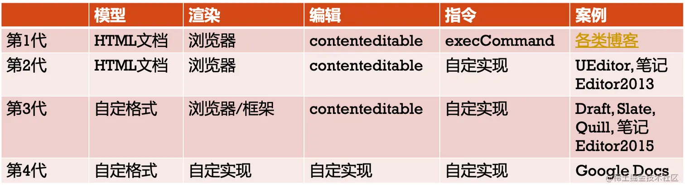

# canvas实现富文本编辑器
- 一个挑战性的实现，将在组件中处理用户输入、文本渲染以及光标的位置
- 不过在实现这之前，当前项目尝试使用的是jsdoc结构，结果还是导入ts约束，为了避免多重混淆增加复杂性，直接使用ts。使用静态类型有助于AI帮忙分析代码。
# ------------------  此线以上更新进展  -------------------
# ------------------ 此线以下为构建步骤 -------------------
# 构建步骤
```
npm create svelte@latest wisehub_svelte  
cd wisehub_svelte  
npm i electron electron-builder cross-env  -D
npm run dev -- --open
```

# 创建/复制 electron项目，配置json<只显示增量>
```
"main": "electron/main.js",
"scripts": {
    "start": "cross-env NODE_ENV=development electron .",
    "test": "vite build & electron .",
    "build": "vite build --mode production && electron-builder",
},
"build": {
    "productName": "WiseHub",
    "directories": {
      "output": "dist/electron-builder"
    },
    "win": {
      "target": [{
          "target": "nsis",
          "arch": ["x64"]
        }]
    },
    "nsis": {
        "oneClick": false,
        "allowToChangeInstallationDirectory": true
    }
},
```
静态文件打包到时跟反逆向一起研究，目前用development

# 反编译electron项目
```
安装asar，./resources/app.asar可逆向
npx asar extract .\app.asar output
```

逆向后出现了整个项目的文件，也是挺让人头疼的  
需要想办法做混淆和反逆向工程。  
不过做原型先不用考虑这么多，先跑出核心功能，再解决这些问题（肯定有方法）。

# 须注意的其他配置文件
- jsconfig.json
  - "checkJs": false,  设置false恢复动态类型，快速开发;建议先尝试写写，当前项目使用的是jsdoc结构
- svelte.config.js
- vite.config.js
- ./src/app.d.ts 似乎只对ts有用

# Flutter<主语>对比
- 跨平台
- 顶部frame的交互设计的更符合逻辑，有成熟好用的组件

# 何时转向
- 因功能相对复杂，先用sveltekit+electron快速开发实现主要功能(忽略UI，不追求细节)，再转向Flutter
